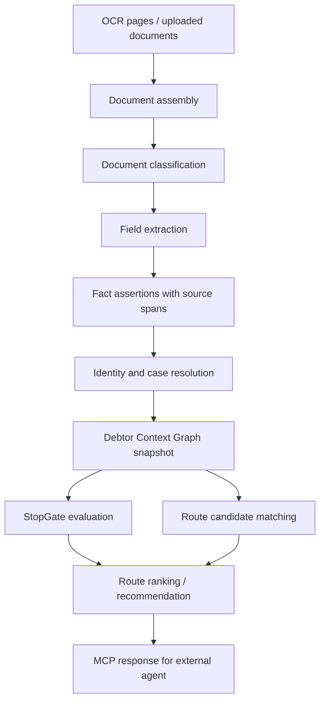

# Recova Debtor Context Graph Research Synthesis

Generated: 2026-07-06

## 한 줄 결론

지금 Recova/TrustGraph에는 **채권추심 온톨로지와 MCP 도구의 뼈대**는 이미 있다. 하지만 실제 채무자 한 명의 200쪽짜리 OCR 묶음을 “기억하고, 버전 관리하고, 다음 추심 루트를 판단하는 뇌”로 쓰려면 아직 **Debtor Context Graph v0**가 필요하다.

내 추천은 이 순서다.

1. 먼저 **채무자별 컨텍스트 그래프**를 만든다.
2. 동시에 그 그래프 위에 얹힐 **채권추심 route ontology**를 얇게 만든다.
3. 법률 조문은 프롬프트 기억이 아니라 **versioned legal rule-source**로 저장한다.
4. 그다음 MCP 도구를 확장해서 여러 에이전트가 같은 그래프를 읽고 갱신하게 만든다.

이유는 간단하다. 에이전트가 “추심 담당자처럼” 일하려면 법을 많이 아는 것보다 먼저, **이 채무자 사건이 지금 어디까지 왔고 어떤 증거가 있는지**를 안정적으로 기억해야 한다.

## 이번에 본 입력

### OCR corpus

- Source: `/Users/cosmos/dev/ocr/MinerU/work/legal_ocr_20260630`
- Evidence: `.omo/evidence/debtor-context-graph/ocr-corpus-shape.json`
- 전체 파일: 211
- Markdown OCR: 208
- OCR markdown lines: 5,185
- `manifest.tsv` 있음
- `missing.txt` 비어 있음

중요한 점은 OCR이 **문서 단위가 아니라 페이지 단위**라는 것이다. 즉 지금 폴더는 “지급명령서 1개, 압류명령 1개”처럼 정리되어 있는 게 아니라, 이미지 페이지들이 풀려 있다.

그래서 실제 ingest 파이프라인에는 이 계층이 필요하다.

```text
OCR Page
-> Document Assembly
-> Legal Document
-> Filing / Procedure Episode
-> Case Packet
-> Debtor Context Graph
-> Route Candidate / Next Action
```

### 실제 OCR classifier coverage

- Evidence: `.omo/evidence/debtor-context-graph/ocr-classifier-coverage.json`
- 평가한 OCR markdown: 208
- `attachment-collection-order`: 30
- `unknown`: 178

이건 나쁜 결과라기보다 좋은 신호다. 현재 v0 classifier가 실제 OCR에서 “채권압류 및 추심명령” 일부를 잡는 것은 확인됐지만, 이 corpus는 대부분 페이지 단위라 문서 전체 문맥 없이는 unknown이 많이 나오는 게 정상이다.

결론: 다음 개발에서 classifier만 늘리면 안 된다. 먼저 **문서 재조립과 사건 묶기**가 필요하다.

### 장기채권 법조치 route manual

- Source: `/Users/cosmos/Downloads/채권추심_장기채권_법조치_루트_총정리.md`
- Evidence: `.omo/evidence/debtor-context-graph/route-manual-summary.json`
- 문서 길이: 2,135 lines
- 추출한 v0 route candidates: 18

manual은 “지식 문서”라기보다 **route 후보 목록**에 가깝다. 그러니까 온톨로지에 넣을 때도 `은행`, `급여`, `부동산` 같은 명사만 넣으면 약하다. 다음처럼 넣어야 쓸모가 생긴다.

```text
RouteTemplate
  - 어떤 상황에서 쓰는가
  - 필요한 증거는 무엇인가
  - 법적 전제조건은 무엇인가
  - 막히는 조건은 무엇인가
  - 예상 산출물은 무엇인가
  - 어떤 법령 조문을 근거로 삼는가
```

## 법령 MCP 검토 결과

법령 MCP로 현재 기준 조문을 다시 확인했다. 핵심은 조문을 프롬프트에 길게 붙이는 게 아니라, **조문 메타와 적용 축을 rule-source로 저장**하는 것이다.

Evidence: `.omo/evidence/debtor-context-graph/korean-law-source-map.json`

이번에 rule-source 후보로 묶은 조문은 18개다.

| 축 | 법령/조문 | 그래프에서 쓰는 방식 |
| --- | --- | --- |
| 채권집행 개시 | 민사집행법 제223조 | 제3채무자에 대한 채권집행은 압류명령으로 시작된다는 route 전제 |
| 추심명령 | 민사집행법 제229조 | 추심명령/전부명령 구분, 전부명령 확정 요건 |
| 압류금지채권 | 민사집행법 제246조 | 급여, 퇴직금, 보증금, 보험, 생계비 계좌 등 압류 target StopGate |
| 재산명시 | 민사집행법 제61조 | 집행권원과 집행력 있는 정본이 있어야 하는 court auxiliary route |
| 재산조회 | 민사집행법 제74조 | 재산명시 이후 조건, 조회 기관 특정, 비용 예납 |
| 채무불이행자명부 | 민사집행법 제70조 | 확정 집행권원 후 6개월 미이행 또는 재산명시 실패 조건 |
| 지급명령 효력 | 민사소송법 제474조 | 지급명령이 확정판결과 같은 효력을 갖는 조건 |
| 확정채권 시효 | 민법 제165조 | 판결 등 확정채권 10년 limitation clock |
| 시효중단 | 민법 제168조 | 청구, 압류/가압류/가처분, 승인 이벤트 |
| 사해행위 | 민법 제406조 | 사해행위 route의 1년/5년 deadline |
| 불법 추심 금지 | 공정추심법 제9조, 제11조, 제12조 | 접촉/표시/관계인 문의/회생·면책 후 반복 요구 StopGate |
| 신용정보 처리 | 신용정보법 제15조, 제32조 | 금융/신용 데이터 ingest의 목적, 최소수집, 동의/예외, 증명책임 |
| 개인회생/파산 | 회생파산법 제593조, 제600조, 제566조 | 중지/금지명령, 개시결정, 면책 감지 시 route block |

특히 법령 MCP가 알려준 중요한 메타는 **현행본과 시행예정본이 따로 있다는 점**이다.

- 민사집행법: 현행 MST `268837`, 2028-03-01 시행예정 MST `284419`
- 민사소송법: 현행 MST `252393`, 2028-03-01 시행예정 MST `284417`
- 신용정보법: 현행 MST `260423`, 2026-08-13 / 2026-09-11 시행예정본 존재
- 회생파산법: 현행 MST `267359`, 2028-01-01 시행예정 관련 개정 존재

그래서 `law_name + lawId + mst + article + effective_date + retrieved_at`를 반드시 저장해야 한다. 그래야 나중에 사건 시점 기준 법령 판단을 할 수 있다.

## 현재 구현되어 있는 것

Evidence: `.omo/evidence/debtor-context-graph/recova-mcp-tools.json`

현재 Recova MCP v0는 16개 tool surface를 제공한다.

- ingest group
- graph group
- stopgate group
- governance group
- read group

현재 확인된 장점:

- MCP 도구 16개가 살아 있다.
- focused MCP tests가 통과한다.
- 합성 fixture manifest에서는 case graph를 만들 수 있다.
- fixture case graph summary: 1 case packet, 9 documents, 116 entities, 117 edges.
- StopGate/governance/read-safe envelope가 이미 있다.
- raw text를 외부 응답으로 그대로 내보내지 않는 redaction 계약이 있다.

현재 한계:

- production ingest backend는 아직 연결되지 않았다.
- 실제 OCR 208쪽은 대부분 unknown이다.
- 실제 채무자별 persistent graph가 없다.
- page -> document -> procedure episode를 조립하는 계층이 없다.
- route 추천은 아직 “진짜 추심 전략 엔진”이라기보다 review-safe placeholder에 가깝다.
- 금융 데이터, 신용정보, 부동산/차량/사업자/보험 같은 외부 증거 source connector가 없다.

## 추천 구조

### 1. 공통 도메인 지식 그래프

이건 모든 채무자에게 공통으로 적용되는 “추심 업무 지식”이다.

담아야 할 것:

- 법률 지식
- 금융/신용 데이터 해석 지식
- 채권추심 업무 플로우
- route template
- route별 필요 증거
- route별 StopGate
- route별 예상 산출물
- 실무 노하우

예시:

```text
RouteTemplate: wage_attachment
  requires:
    - enforceable_title
    - debtor_employer_hint
    - claim_balance
  blocks_on:
    - insolvency_stay
    - wage_exemption_review
    - identity_uncertain
  legal_sources:
    - 민사집행법 제223조
    - 민사집행법 제229조
    - 민사집행법 제246조
  expected_artifacts:
    - 채권압류 및 추심명령 신청서
    - 제3채무자 특정 정보
    - 청구채권 계산표
```

이건 `resources/ontologies/recova-debt-collection.json`를 확장하거나 별도 `recova-debt-route-ontology.json`로 분리할 수 있다.

내 추천은 **처음에는 별도 route ontology로 분리**하는 것이다. 이유는 기존 ontology는 문서/사건/StopGate 쪽이고, route 지식은 빠르게 바뀌며 실무 튜닝이 많기 때문이다.

### 2. 채무자별 Debtor Context Graph

이건 채무자 한 명 또는 한 채권 사건 묶음에 대해 쌓이는 “사건 기억”이다.

핵심 노드:

- `DebtorGraph`
- `DebtorIdentity`
- `IdentityEvidence`
- `CasePacket`
- `Claim`
- `ClaimBalance`
- `EnforcementTitle`
- `CourtProcedureEpisode`
- `LegalDocument`
- `DocumentPage`
- `DocumentAssembly`
- `SourceSpan`
- `FactAssertion`
- `AssetHint`
- `ThirdPartyDebtor`
- `InsolvencySignal`
- `LimitationClock`
- `StopGateResult`
- `RouteCandidate`
- `ActionRecommendation`
- `ReviewDecision`
- `GraphSnapshot`

핵심은 모든 중요한 사실을 `FactAssertion`으로 감싸는 것이다.

```text
FactAssertion
  fact_id
  subject_id
  predicate
  object_value
  confidence
  source_document_id
  source_hash
  source_ref
  chunk_id
  line_start
  line_end
  extractor_version
  ontology_version
  valid_time
  observed_time
  review_status
```

이렇게 해야 나중에 OCR을 다시 돌리거나 classifier가 개선되어도 “예전 판단이 왜 나왔는지”가 남는다.

### 3. 버전 관리

채무자 그래프는 mutable document가 아니라 append-only에 가깝게 가야 한다.

추천 버전 구조:

```text
GraphSnapshot v1
  - source bundle hash
  - extractor versions
  - ontology version
  - legal rule-source version
  - fact assertions included
  - route candidates included
  - stopgate results included

GraphSnapshot v2
  - added new OCR pages
  - revised document assembly
  - one fact promoted by reviewer
  - route ranking changed
```

즉 “현재 상태”를 바로 덮어쓰지 말고, `snapshot_id`를 계속 늘린다.

### 4. TrustGraph 활용 방식

TrustGraph를 버리지 말고 이렇게 쓰는 게 좋다.

```text
TrustGraph collection
  workspace: recova-lab
  collection: debtor:{debtor_graph_id}

stores:
  - chunks / embeddings
  - graph triples
  - fact assertions
  - source references
  - snapshot metadata

Recova legal package
  - deterministic classifiers
  - field extractors
  - document assembler
  - route candidate engine
  - stopgate engine
  - MCP facade
```

TrustGraph의 collection 개념은 채무자별 격리에 잘 맞는다. 다만 raw PII와 원문 파일은 TrustGraph 응답으로 바로 흘리지 말고, source ref만 연결하는 방식이 좋다.

## 왜 채무자 그래프를 먼저 해야 하나

도메인 논리를 먼저 많이 만들 수도 있다. 하지만 지금 OCR evidence를 보면 실제 문제는 “법률 지식 부족”보다 먼저 이것이다.

1. 페이지가 문서로 조립되어 있지 않다.
2. 문서가 절차 episode로 묶여 있지 않다.
3. 같은 채무자/같은 사건/같은 채권인지 판단하는 identity resolver가 없다.
4. 사건의 시간축이 없다.
5. route 판단에 필요한 사실이 증거와 함께 정규화되어 있지 않다.

그러니까 지금은 도메인 논리를 더 넣기 전에, 그 논리가 올라탈 **사건 기억 구조**를 먼저 만들어야 한다.

하지만 route ontology를 아예 미루면 안 된다. 왜냐하면 document assembly가 어떤 사실을 뽑아야 하는지 route ontology가 알려주기 때문이다.

따라서 추천은:

```text
Debtor Context Graph v0 먼저
+ Route Ontology v0 얇게
+ Legal Rule Source v0 얇게
```

## Debtor Context Graph v0 제안

### 입력

- OCR folder
- OCR zip
- manifest.tsv
- 기존 fixture manifest
- 수동 업로드 문서
- 향후 금융/신용/등기/차량/사업자/보험 데이터 source

### 출력

```json
{
  "schema_version": "recova-debtor-context-graph/v1",
  "debtor_graph_id": "...",
  "graph_snapshot_id": "...",
  "identity_resolution": {...},
  "case_packets": [...],
  "documents": [...],
  "fact_assertions": [...],
  "claims": [...],
  "enforcement_titles": [...],
  "procedure_episodes": [...],
  "asset_hints": [...],
  "stop_gates": [...],
  "route_candidates": [...],
  "review_items": [...]
}
```

### 판단 순서



## Route Ontology v0 제안

이번 manual에서 v0로 가져갈 route는 다음 18개다.

1. `title_acquisition_payment_order`
2. `limitation_extension_lawsuit`
3. `bank_account_attachment`
4. `wage_attachment`
5. `severance_attachment`
6. `lease_deposit_attachment`
7. `real_estate_auction`
8. `vehicle_attachment`
9. `business_receivable_attachment`
10. `card_pg_platform_settlement_attachment`
11. `insurance_refund_or_claim_attachment`
12. `tax_refund_or_public_receivable_attachment`
13. `inheritance_review_and_share_attachment`
14. `fraudulent_transfer_lawsuit`
15. `property_disclosure`
16. `property_inquiry`
17. `debtor_default_registry`
18. `insolvency_review_or_cease_collection`

각 route는 반드시 아래 필드를 가져야 한다.

```json
{
  "route_id": "bank_account_attachment",
  "family": "financial_asset",
  "required_facts": ["enforceable_title", "third_party_debtor_bank_hint"],
  "blocking_facts": ["insolvency_stay", "exempt_deposit_risk"],
  "legal_sources": ["민사집행법 제223조", "민사집행법 제229조", "민사집행법 제246조"],
  "expected_artifacts": ["attachment_application", "claim_balance_sheet"],
  "review_policy": "external_approval_required"
}
```

## 다음 구현 계획

### Phase 1: Document Assembly

목표: 실제 OCR 208쪽을 문서/절차 단위로 묶는다.

작업:

- `DocumentPage` 모델
- `DocumentAssembly` 모델
- 페이지 제목/사건번호/법원명/문서 표지/문구 기반 grouping
- OCR folder -> assembly manifest 생성 CLI
- assembly evidence에서 raw text 제외

성공 기준:

- `legal_ocr_20260630` corpus에서 page cluster가 생성된다.
- unknown 178쪽이 그대로 버려지지 않고, 어떤 문서 후보에 속하는지 표시된다.

### Phase 2: Debtor Context Graph Builder

목표: 기존 `case_graph.py`를 확장해 실제 채무자별 graph snapshot을 만든다.

작업:

- `debtor_context.py`
- `DebtorGraphPayload`
- `FactAssertion`
- `GraphSnapshot`
- identity resolver
- case packet resolver
- source hash 기반 replay

성공 기준:

- 실제 OCR corpus에서 PII-safe graph summary가 나온다.
- `debtor_graph_id`, `graph_snapshot_id`, `case_packet_id`가 안정적으로 생성된다.

### Phase 3: Route Ontology v0

목표: manual route 18개를 machine-readable template으로 만든다.

작업:

- `resources/legal_routes/debt_collection_routes_v0.json`
- validator
- route candidate matcher
- tests

성공 기준:

- graph facts를 넣으면 route 후보와 missing facts가 나온다.

### Phase 4: Legal Rule Source v0 확장

목표: 법령 MCP로 확인한 조문을 curated rule-source로 저장한다.

작업:

- `resources/legal_rules/debt_collection_route_sources_v0.json`
- article metadata: lawId, MST, article, effective_date
- current/future version flags
- applicable-date lookup hook

성공 기준:

- route candidate마다 legal source가 연결된다.
- future-effective 법령이 있는 경우 review note가 나온다.

### Phase 5: MCP Tool 확장

목표: 여러 agent가 채무자 그래프를 읽고 갱신할 수 있게 한다.

추가 MCP 후보:

- `ingest_debtor_bundle`
- `assemble_debtor_documents`
- `build_debtor_context_graph`
- `get_debtor_graph_snapshot`
- `list_debtor_route_candidates`
- `explain_route_candidate`
- `record_debtor_graph_review`
- `compare_debtor_graph_snapshots`

기존 16개 도구는 유지하고, 새 도구는 `debtor-graph` group으로 분리하는 게 좋다.

### Phase 6: Eval Harness

목표: 실제 추심 루트 판단이 점점 좋아지는지 측정한다.

평가 질문 예시:

- 이 사건에서 집행권원은 있는가?
- 지급명령이 확정판결과 같은 효력을 갖는 상태인가?
- 소멸시효 risk가 있는가?
- 회생/파산/면책 StopGate가 있는가?
- 압류 가능한 자산 후보는 무엇인가?
- 제3채무자를 특정할 수 있는가?
- 지금 바로 가능한 route와 missing facts는 무엇인가?
- 다음에 수집해야 하는 증거는 무엇인가?

## 최종 판단

이 구조가 완성되면 Hermes든 다른 agent든 붙일 수 있다. 중요한 것은 agent 종류가 아니라 MCP 뒤의 뇌가 다음을 제공하는지다.

- 채무자별 사건 기억
- 증거 기반 사실
- 법률 rule-source
- 실무 route 후보
- StopGate
- 버전 관리
- review/audit trail

현재 구현은 그중 **MCP facade, basic ontology, classifier/field extractor, fixture case graph, StopGate/governance skeleton**까지 와 있다.

이제 필요한 핵심은 **Debtor Context Graph + Document Assembly + Route Ontology**다.

내 추천은 바로 Phase 1부터 들어가는 것이다. 실제 OCR corpus가 이미 있으니, 추상적인 도메인 온톨로지를 더 쓰기보다 이 한 케이스를 제대로 기억하는 graph를 만들면서 route ontology를 같이 키우는 게 가장 빠르다.

## Evidence index

- `.omo/evidence/debtor-context-graph/ocr-corpus-shape.json`
- `.omo/evidence/debtor-context-graph/ocr-classifier-coverage.json`
- `.omo/evidence/debtor-context-graph/route-manual-summary.json`
- `.omo/evidence/debtor-context-graph/korean-law-source-map.json`
- `.omo/evidence/debtor-context-graph/recova-mcp-tools.json`
- `.omo/evidence/debtor-context-graph/focused-mcp-tests.txt`
